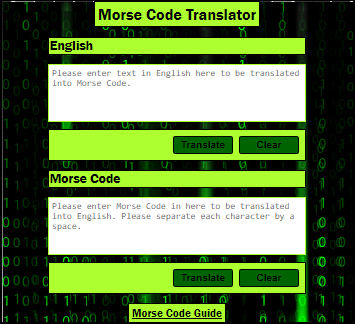

# morse-translator

A web page for Morse Code-to-English &amp; English-to-Morse Code Translation

## Outline

This task will require you to create a web page Morse Code translator. The User Interface will have to look good but should remain simple (additional features, ie. sounds, lights, etc, should only be added once the MVP has been completed.)

## MVP

1. Create a user interface that allows the user to either input some English text or some Morse Code

2. Create JS functions that would allow the user to:

-   Translate their English text into Morse Code
-   Morse Code into English text

3. Make sure to handle spaces properly (ie. there is 1 space between English words, but one space between Morse Code characters)

4. Make sure to separate pure JS functions and DOM manipulation

5. Add unit testings for each of the pure function that your translator uses (each function should have at least 4 tests, think of edge case, wrong inputs, etc ...)

## Live Image

## HTML Implementation

1. The index.html + style.scss files have the UI design and implementation of the morse code translator.
2. Styling of the UI has been done using SCSS & BEM convention.
3. The color palettes are defined using partials.
4. The UI has two text areas to input the english and morse code and to output the respective translated code as well.
5. There are two Translate buttons, on click of which the inputs are read and translated using DOM objects and javascript.
6. Two Clear buttons are provided to clear the inputs and reset the text areas.
7. There is a link provided at the bottom of the page which opens an image with a guide to Morse Code alphabets for user reference.

## Javascript Implementation

1. The DOM objects manipulation is handled separately from rest of the javascript code in the dom-utils.js file.
2. The translate.js file handles all the other functions which validate the input data and then translate it to either english-to-morse or morse-to-english.
3. The morsecode.js has a list of all the english-to-morse or morse-to-english characters for validating the user input.

## Unit Testing implementation

1. Test cases for the function isValidChar() which checks if the input text in english contains any invalid morse code character
2. Test cases for the function isValidMorse() which checks if the input text in morse are valid or not
3. Test cases for the fuction toMorse() which returns the translation of english input to morse code if the input is valid or else throws an error
4. Test cases for the fuction toEnglish() which returns the translation of morse code input to english if the input is valid or else throws an error
